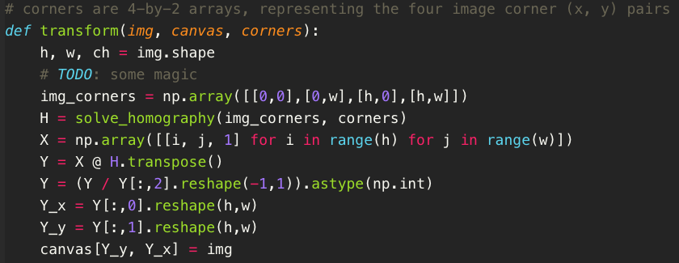
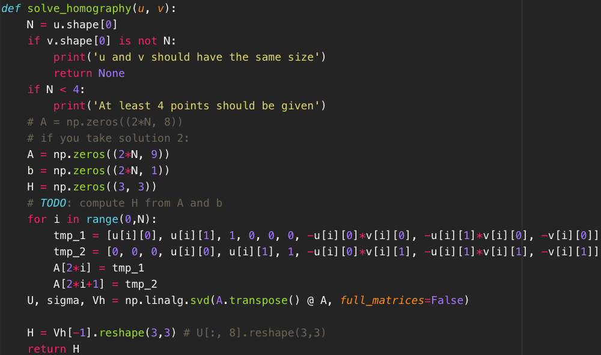
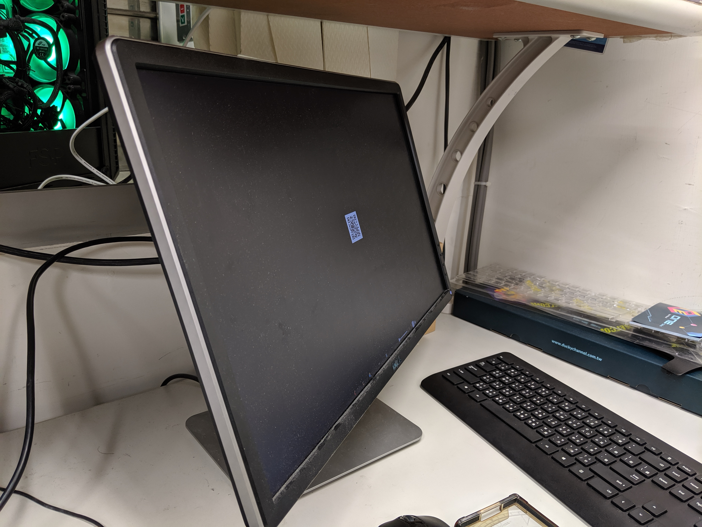
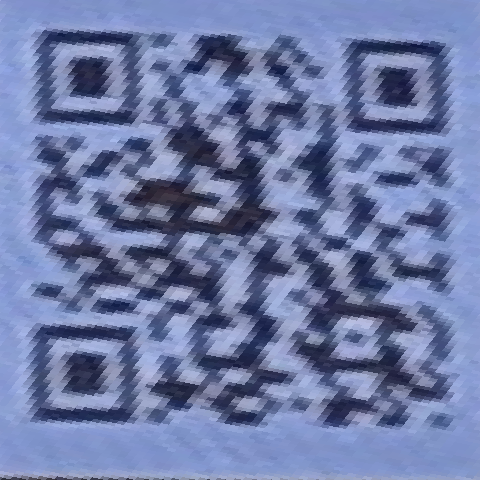
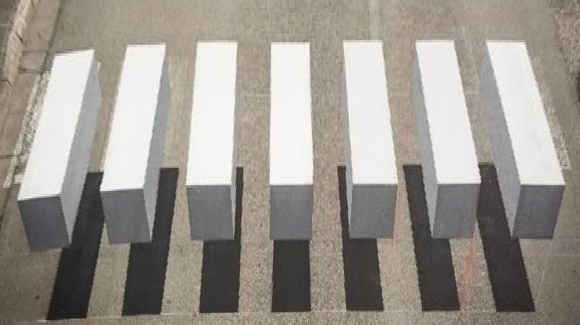
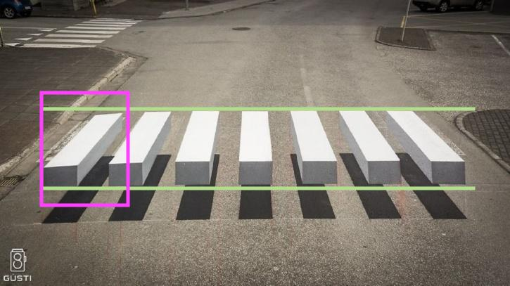
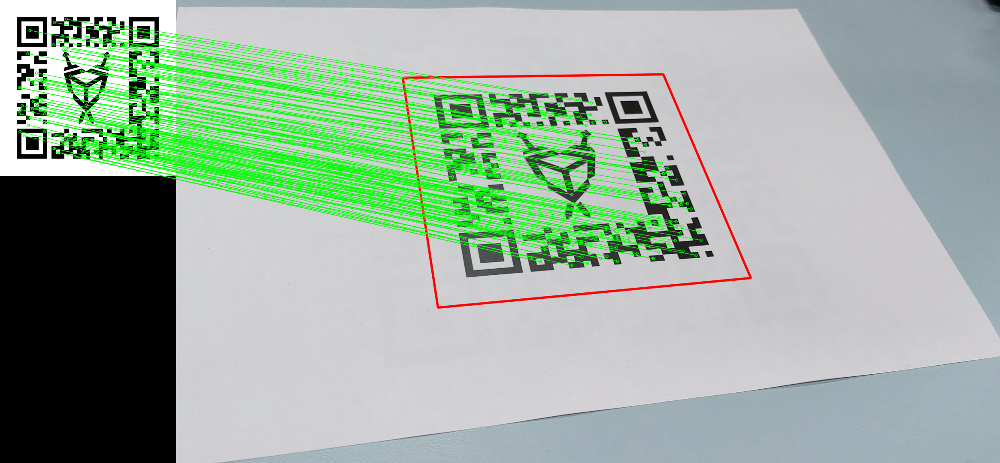
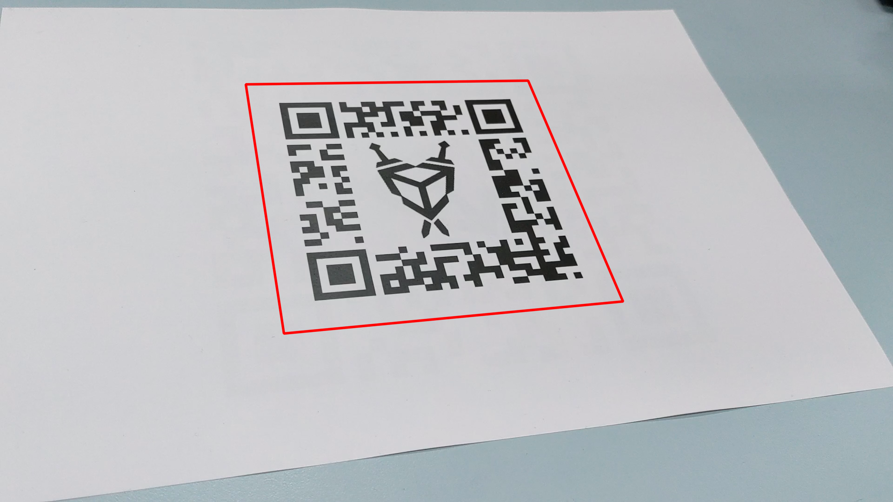
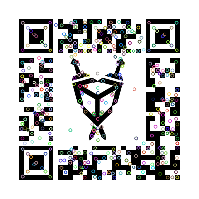
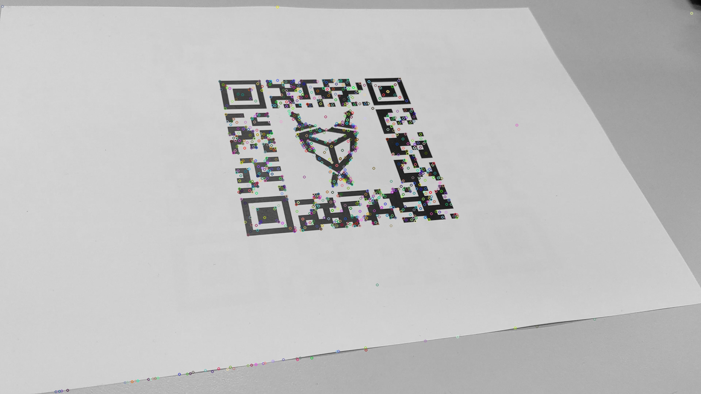

# Projective Geometry

**TOC**

* [Environment setting (package version)](#Environment_setting)

* [Usage](#Usage)

* [Part 1: Estimating Homography](#Part_1-Estimating_Homography)
  
  * [Implementation](#Implement_solution_2)
  * [Solve_homography](#solve_homography)
  * [Result-01](#Result-01)
  
* [Part 2: Unwarp the Screen](#Part_2-Unwarp_the_Screen)

  * [Unwarp region](#Choose_the_unwarp_region)
  * [Result-02](#Result-02)

* [Part 3: Unwarp the 3D Illusion](#Part_3-Unwarp_the_3D_Illusion)

  * [Result-03](#Result-03)
  * [Discussion](#Discussion)

* [Part 4: Simple AR](#Part_4-Simple_AR)
  
  * [Algorithm](#Algorithm)
  * [Result-04](#Result-04)
  
  

## Environment_setting

- System : MacOS Mojave
- Python version : 3.7.4
- Opencv-contrib : 3.4.2
- Numpy : 1.16.2
- Matplotlib : 3.0.3

## Usage

- Part 1~3 : python3 main.py

- Part 4 : python3 part4.py <path>

  - <path> path to ar_marker.mp4

  - E.g. python3 part4.py ./input/ar_marker.mp4

    

## Part_1-Estimating_Homography

### Implement_solution_2

###  solve_homography

I use solution 2 to solve the H parameters. I solve the homogeneous system by using numpy package *SVD* in linalg and let ℎ be the last column of Vh.

All implementations of functions follow the guideline in homework file provided by teacher.

### Result-01

## Part_2-Unwarp_the_Screen

### Choose_the_unwarp_region

My region : np.array([ [1984,1244], [2040,1215], [2028,1396], [2081,1365]])

### Result-02

| Original Image |  |
| -------------- | ----------------------- |
| QR code        |  |
| Decoded Link        | [http://media.ee.ntu.edu.tw/courses/cv/19F/](http://media.ee.ntu.edu.tw/courses/cv/19F/?fbclid=IwAR0vrS5qG2CkDRtnpPDsHjfRM6DRQIao8QypoGXC0DKXetQ5gLWB9s_ZxoU) |

## Part_3-Unwarp_the_3D_Illusion

### Result-03

### Discussion

We found that we cannot get the parallel bars from the top view like the Ground truth one. That is because the bars in the given image are not perfectly parallel. To be more specific, the leftmost bar in the image has downward deflection which may cause the bars in result image won't be parallel after transformation. (Show in figure below.)

## Part_4-Simple_AR

### Algorithm

In this part, I follow the reference here. [OpenCV](https://opencv-python-tutroals.readthedocs.io/en/latest/py_tutorials/py_feature2d/py_feature_homography/py_feature_homography.html)

work flow is provided below.

1. **Main** function

   - Resize & Cut the video into single frame.
   - Use **img_matcher** to get canvas corners in the frame.
   - Use **transform** function to crop the ref_image into each frame.

2. **Img_matcher** function

   - Use Scale-Invariant Feature Transform to compute keypoints
   - Use FlannBasedMatcher to match the descriptions of keypoints & optimize for high dimensional features
   - Use Lowe's ratio test to remove inappropriate matching points
   - Use cv2.findHomography function to find corresponding canvas corner

3. **Transform** function

   - This function is the same function as in part 1.
   - Use solve_homography solve the transformation matrix.
   - Apply matrix to each X points.
   - Since some canvas corner points may be **out off image frame**, we only apply transformation matrix to those points **inside the frame**.

> Some tricks are here :
>
> - resize the ref image by 1/3
> - auto_crop in the main function can crop the template image into more precise one. 
>   Ex. template = template[ 35:375, 35:375, :]

### Result-04

- **Execution Time** : approximately **9** mins
  
- **Video Result**

  

- **Analysis**
  **Following are the matching result and cropping corner.**
  
  | DrawMatches                              | Mask                       |
  | ---------------------------------------- | -------------------------- |
  |  |  |
  
  **Following are the keypoints in the queryImage and trainImage.**
  
  | kp_queryImage                               | kp_trainImage                        |
  | ----------------------------------------- | --------------------------- |
  |  |  |
  

## Other comments

<Note> In this project, we use the reference info. and code from openCV [here](https://opencv-python-tutroals.readthedocs.io/en/latest/py_tutorials/py_feature2d/py_feature_homography/py_feature_homography.html). We thank the authors.

